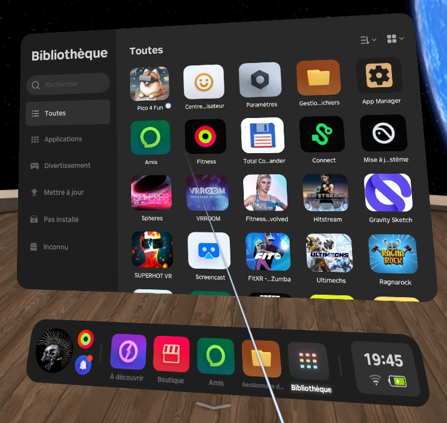
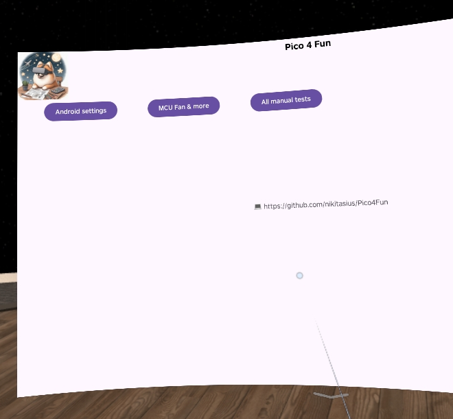
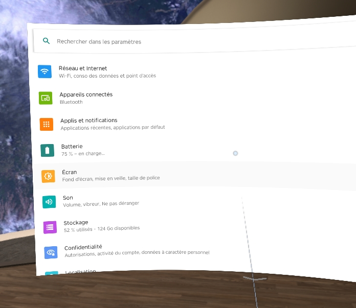
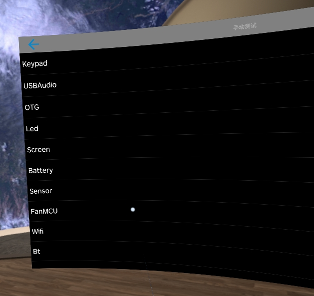
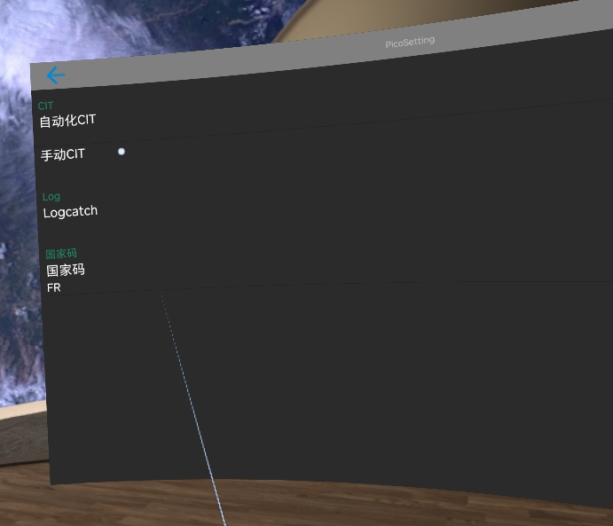

# Pico 4 Fun

# Disclaimer:

> play and/or use at your own risk. Only you are responsable for VR damage, brain damage or any burned stuff or whatever
> it can fuckup!

## That app allow you to access:

* android settings menu
    * and you can tune it as any android
* manual tests menu
    * here you can override fan settings via MCU Fan and do whatever you want, haha
* full factory tests menu
    * to play or kill your Pico

## Whats the difference?

* opensource stuff, check the core bruh/sis
* apk are build by github actions, not by dev
* pretty small size, just a dog was added

## How to install

* go to [releases](https://github.com/nikitasius/Pico4Fun/releases/latest)
* download APK and copy on your Pico 4
* install it via filemanager
* click on a pomeranian!

## Screenshots

### Launcher

### Main App

### Android settings

### Manual tests menu & MCU Fan section

### Full factory tests

